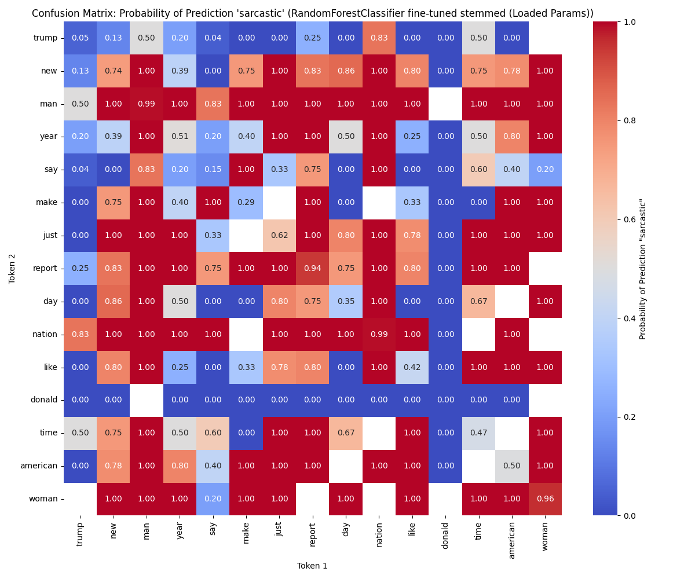
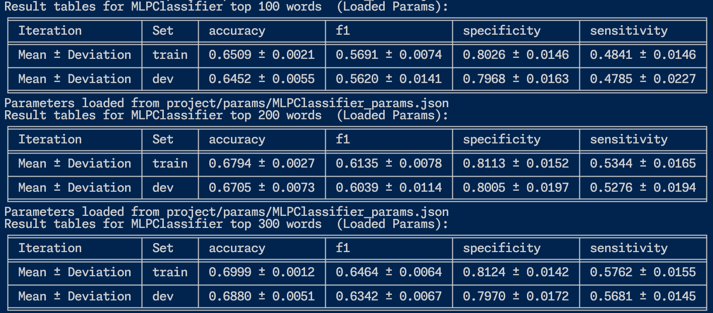
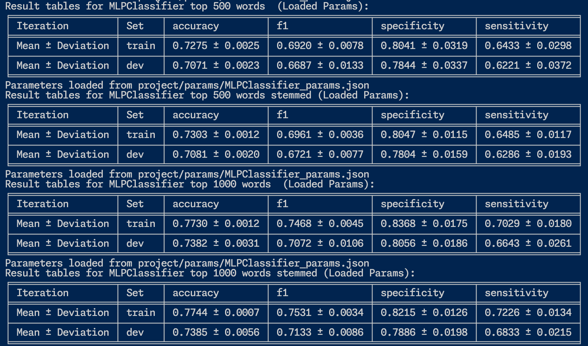

# Project: Sarcasm Detection

## 📃 Abstract

This project uses different classifiers (Decision Tree, Random Forest, Multi-Layer Perceptron, Support Vector Machine) for sarcasm detection using sklearn. Training and testing are performed on a dataset for sarcasm detection. This report provides the used dataset, implementation, results, and discussion of the experiments.

## 🚀 Introduction

As our project task, we would like to train a model for sarcasm detection so it can identify whether a sentence is sarcastic or not. The hope is to help people who have difficulty differentiating sarcastic from non-sarcastic sentences, like autistic and neurodivergent people.

For detailed instructions on how to run the code and create the results below refer to [./src/README.md](./src/README.md).

The raw results can be found in the [./results/](./results/) directory and the parameters for our best-hyperparameter-tuned model in the [./params/](./params/) directory.

## 📑 Dataset
We will use the "News Headlines Dataset for Sarcasm Detection" [^1]. In comparison to other existing Twitter sarcasm datasets, that mostly use hashtags to determine if a tweet is sarcastic or not, this dataset uses high-quality labels. 

The dataset has two distinct versions from which we will use the second one. It consists of 28619 data points which have a nearly 50/50 split into non-sarcastic and sarcastic:

| Label  | Data points  |   
|---|---|
| Sarcastic | 13634  |  
| Non-Sarcastic | 14985  |

No data points have more than one label. The analysis of the distribution is created on the whole dataset because it is important to understand any possible bias in the dataset to one label or the other. If you only analyze the labels on the training data, you might miss out on a potential bias in the test data which could affect the model's performance. 

Each sample has three attributes: the headline, if it is sarcastic or not, and a link to the original article. 

The input of our model is a one-hot encoding (potentially the string itself for more complex models) of the headline/sentence and the output is if the headline is sarcastic or not. 

Here are 5 samples of our data before the one-hot encoding:

### Creation of Train/Test/Dev Split
Before we do the feature selection, the dataset has to be split into train, test, and dev. The test set is created with the 'sklearn.model_selection.train_test_split' function.  The splits are saved under [./data/splits/](./data/splits/).

A 60-20-20 train-dev-test split is used with cross-validation. We use cross-validation for the train-dev split, as it provides a better estimate of model performance by averaging results across multiple splits. It also maximizes the use of our data, because we can train our model on the whole training data. Also by training on different subsets of the data, the model is less likely to overfit on it. We use 4 folds so that 60% of the data is used for training and 20% for development.

After training and hyperparameter-tuning, before we test our model on the test set, we train the model on the whole train set for maximal performance.

|   | Train+Dev  | Test  |   
|---|---|---|
| % of data points  | 80  | 20  |   
| Number of data points  | 22895  | 5724 |

### Feature extraction
The features of our model are created using one-hot encoding. Here are 5 samples after the one-hot encoding:

## 📈 Hypotheses about the performance of our model
The performance will vary depending on the complexity of our model. We expect an accuracy of ca. 60-70% of our simpler decision-tree-based models and ca. 70-80% of the more complex models like RNN or LSTM.

## 📊 Evaluation 
In our project, we use four alternate evaluation metrics:
### Accuracy
Measures the proportion of correctly classified sentences out of the total number of sentences. 
As our dataset is balanced this simple metric gives us an easily interpretable metric for our model's performance.
We do not have a strong preference for whether our model should prefer sarcastic over non-sarcastic sentences and therefore accuracy is a simple great choice.

### F1-Score
Measures the harmonic mean of precision and recall, balancing the trade-off between false positives and false negatives.
Has a similar foundation as accuracy, while penalizing extreme biases. 

### Specificity
Measures the proportion of correctly classified non-sarcastic sentences out of all actual non-sarcastic sentences.
In some scenarios, it is more important to identify non-sarcastic sentences accurately. It makes sure our model is not overly biased towards detecting sarcasm reducing false positives. 

### Sensitivity (Recall)
Measures the proportion of actual sarcastic sentences that the model successfully identified as sarcastic.
In other cases it is more important to identify sarcastic sentences accurately. Sensitivity makes sure oru model is not overly biased towards detecting non-sarcasm reducing false negative. Therefore it complements specificity perfectly. 

## 🏁 Baseline generation
We use three different baselines: 
* a random baseline
* a random baseline, which uses the probability distribution of the training data
* a majority baseline, which will label all the samples as non-sarcastic in our case

The following results are generated on the not stemmed 100 top tokens data splits.
### Results of random baseline

All the different scores for all baselines on train, dev, and test have a random baseline accuracy of around 50%. This is expected from a random assignment of classes for a binary task. The results show, that our dataset is fairly balanced and our splits preserve this ratio. 

### Results of random baseline with the probability distribution of train

In the random baseline probability distribution of the train experiment specificity is higher than the sensitivity indicating the small imbalance of our dataset to non-sarcastic data points. However, this disharmony can be seen on all splits, showing that our splits have the same distribution as our whole dataset. The accuracy and f1-score are around the same as our random baseline because even though we have a small imbalance (around 2%) in our dataset, our data is still quite balanced. 

### Results majority baseline

The results of the majority baseline show a specificity of 100%, an accuracy of 52%, and a f1-score/sensitivity of 0%, for all splits. Since our dataset has a small imbalance to non-sarcastic data the majority baseline classifies all samples as non-sarcastic, resulting in a specificity of 100%. On the other hand, the sensitivity is 0% because no data point was classified as sarcastic. This also results in a f1-score that is 0%. The accuracy reflects the disharmony of our dataset. 

### What does it mean, if the performance of our model is lower than the respective baseline?

This suggests that the model is not learning or generalizing effectively. This could indicate a multitude of different problems, e.g. under- or overfitting, noisy or insufficient data. Alternatively, our baseline could be so strong, that our model just can not compete with it and we need to improve it even further for relevant results.

The choice of evaluation metric could influence the performance of our model vs the baseline. E.g. if our data is not balanced a majority baseline could outperform our model with a naive approach. In such a case the f-1 score gives a better picture of the real performance of our baseline. 

## 🧮 Methods used in the following classifications

For each classification, we used the same methods to train multiple different models and analyze their respective results.

As a model baseline, we used the sklearn default parameters. After that, we hyperparameter-tuned (sometimes mistakenly called "fine-tuning"; we realized the difference to late to change all the plots and code) our models using a range of parameters using grid search (the used parameters for each model can be found here [./src/run.py/](./src/run.py/)). As a next experiment, we tried different numbers of top tokens for our one-hot encodings, optionally stemming the words before the one-hot encoding. We hope to gain knowledge about how many features/tokens and therefore information each model needs for their optimal performance.

To analyze the importance of our features, and the importance of our top n tokens, we used the build in 'model.feature_importances_' attribute. This attribute is only available for the Decision Tree and Random Forest Classifiers.

## 🌳 Classification: Decision Tree and Random Forest
The following results are created using Decision Tree and Random Forest Classifiers.

A Decision Tree is a simple classification model that splits data into branches based on features, making sequential decisions to reach a prediction.

A Random Forest is an array of multiple Decision Trees that tries to improve accuracy and reduce overfitting by averaging the predictions of many trees trained on different data subsets.

The results for the default parameters and the hyperparameter-tuning of the model are performed on the 200-word dataset without stemming. Otherwise, the hyperparameter-tuning would have taken too long.

### Default Parameters

The performance of the decision tree and random forest with default parameters is okay but the models outperform our baseline only very slightly. The specificity increased for both models in comparison to the baseline, however the sensitivity decreased. Therefore the f1-score increased barely, but the accuracy improved by 10% compared to the random baseline.

### Hyperparameter-tuning

Hyperparameter-tuning improved our models by a fair margin, resulting in a higher accuracy and f1-score for both models. The specificity decreased, however the sensitivity increased. This means that our model is less cautious classifying a headline as sarcastic.

### Feature selection: Different number of top n tokens for one hot encoding

The decision tree models' accuracy and f1-score increase until 400 tokens are reached. More tokens did not increase our model any further. To avoid overfitting using more tokens should be avoided.

The random forest models' accuracy and f1-score increase until 1000 tokens are reached. More tokens did not increase our model any further. To avoid overfitting using more tokens should be avoided.

Tables for best models:

For the full result tables please refer to [Appendix 1.1](#a11-feature-selection-different-number-of-top-n-tokens-for-one-hot-encoding).

### Feature selection: With/Without Stemming

For the decision tree, stemming increased the accuracy only slightly, however the f1-score increased by a bit with stemming. With more than 300 words with stemming the f1-score stopped increasing, even dropped a bit, indicating overfitting. Therefore our best decision tree model is the hyperparameter-tuned 300 words model with stemming.

For the random forest, stemming increased the accuracy and f1-score only very slightly. As it does not harm our model's performance we can use stemming.
The best performance was achieved by the 1500-words stemmed dataset.

Tables for best results:

For the full result tables please refer to [Appendix 1.2](#a12-feature-selection-withwithout-stemming).

### Feature importance
The feature importance is created on the 100 top token dataset because otherwise, the graph is unreadable. However, we compared the results for datasets with more words and the most important words remained the same. This means that the model bases its prediction on the most frequent words because the models with more tokens add only less frequent words.

As we are not selecting features manually we can not compare the results to the other tasks. However, the graphs are quite easily understandable on their own. We are not sure if we can make any conclusions from the graphs, but they are nice to look at and may help us to debug and understand the output of our model.

## ⚙️ Classification: Multi-Layer Perceptron
The following results are created using a Multi-Layer Perceptron (MLP). A MLP is a type of neural network composed of interconnected neurons, that can capture nonlinear relationships in data.

The results for the default parameters and the hyperparameter-tuning of the model are performed on the 200-word dataset without stemming. Otherwise, the hyperparameter-tuning would have taken too long.

### Default Params

The MLP baseline outperforms our baseline by a few percentile. Compared to our random baseline the f1-score increased by 5%. However, we ran into a warning `Warning: ConvergenceWarning: Stochastic Optimizer: Maximum iterations (200) reached and the optimization hasn't converged yet.` indicating that our model has not converged yet and therefore an optimal performance can not be expected. This problem should be solved by hyperparameter-tuning the model.

### Hyperparameter-tuning

Hyperparameter-tuning the MLP model improved all our scores by a few percent. The f1-score increased by around 2% and the accuracy by circa 1.5% compared to the baseline. As expected we did not run into the `ConvergenceWarning` showing that hyperparameter-tuning resulted in our model converging on our data.

### Feature selection: Different number of top n tokens for one hot encoding 

The MLP classifier's accuracy, f1-score, and sensitivity increase with more tokens in the one-hot encoding. The specificity decreased with more tokens. However, the model's scores did not flatten as can be seen for e.g. the Random Forest. Potentially our model's performance can improve by increasing the one-hot encoding size further.

We expanded the maximal number of tokens in the next experiment.

For the full result tables please refer to [Appendix 2.1](#a21-feature-selection-different-number-of-top-n-tokens-for-one-hot-encoding).

### Feature selection: With/Without Stemming

Stemming did not change the scores for our model by a fair margin. However, in hope of combatting overfitting our model to the one-hot encodings we will use the stemmed version of our data in the future experiments.

Our model's performance indeed increased with more than 1000 tokens, as we expected in the previous experiment. Our best model is the 2000 token not stemmed model. Another observation is that our curve starts to flatten with 2000 tokens indicating that 2000 tokens could be the optimal parameter for our model. Further research is necessary if our model could still improve with more tokens because with our resources the 2000 tokens model took a long time to train and more tokens would be unreasonable.

Tables for best results:

For the full result tables please refer to [Appendix 2.2](#a22-feature-selection-withwithout-stemming).

### Feature importance

Feature importance is not available for MLPs, because it does not make a clear sense for a highly non-linear and interconnected model.

## 🔤 Classification: Support Vector Machine
The following results are created using a Support Vector Machine (SVM). An SVM is a supervised learning model that finds the optimal hyperplane to separate the data points into different classes by maximizing the margin between them. It is effective both for linear and nonlinear classifications. [^2]

The results for the default parameters and the hyperparameter-tuning of the model are performed on the 200 word dataset without stemming. Otherwise, the hyperparameter-tuning would have taken too long.

### Default Params

The SVM baseline outperforms our baseline quite by a large margin. The f1-score is around 10% better and the accuracy by around 17%. 

### Hyperparameter-tuning

Hyperparameter-tuning the SVM model did not improve the performance further. The default parameters are already the optimal parameters.

### Feature selection: Different number of top n tokens for one hot encoding 

The SVM classifier's accuracy, f1-score, and sensitivity increase with more tokens in the one-hot encoding. The specificity first decreased with more tokens, but then rose again. However, the model's scores did not flatten, similar to the MLP. Potentially our model's performance can improve by increasing the one-hot encoding size further. The training for the 1000 token dataset took a long time already. Further research with higher-end hardware is necessary if larger one-hot encodings can improve the model further.

For the full result tables please refer to [Appendix 3.1](#a31-feature-selection-different-number-of-top-n-tokens-for-one-hot-encoding).

### Feature selection: With/Without Stemming

Stemming did not change the scores for our model by a lot. However, in hope of combatting overfitting our model to the one-hot encodings we will use the stemmed version of our data in the future experiments, like for the MLP.

Our best models are the models trained on the 1000 stemmed/not-stemmed dataset:

For the full result tables please refer to [Appendix 3.2](#a32-feature-selection-withwithout-stemming).

### Feature importance

Feature importance is not available for SVMs, because they focus on finding the optimal decision boundary rather than directly modeling feature contributions.

## ⚖️ Comparison of Models on dev-set
### Baseline vs. Decision Tree vs. Random Forest vs. MLP

|   | Accuracy  |   f1  |   Specificity  |   Sensitivity  |   
|---|---|---|---|---|
| Dummy Random (Distribution of Train) | 0.5017 +/- 0.0129   | 0.4750 +/- 0.0135  | 0.5276 +/- 0.0123  | 0.4732 +/- 0.0135  |  
| Decision Tree | 0.6769 +/- 0.0058 | 0.6159 +/- 0.0068  | 0.7980 +/- 0.0079  | 0.5438 +/- 0.0068  |  
| Random Forest | 0.7102 +/- 0.0070  | 0.6461 +/- 0.0087  | 0.8510 +/- 0.0082  | 0.5554 +/- 0.0088  | 
| MLP | 0.7555 +/- 0.0055  | 0.7377 +/- 0.0051  | 0.7859 +/- 0.0240  | 0.7221 +/- 0.0192  |   

In this experiment, we compare the Dummy Random baseline with our best Decision Tree, Random Forest, and MLP models on the development dataset.

All our models perform better than our Dummy Random baselines.
Overall the random forest model outperforms our decision tree model. The accuracy of our best models is around 2% better and the f1-score is around 4%. The sensitivity and specificity changed comparably. The MLP has a better accuracy, f1-score, and sensitivity than our Random Forest model, however the specificity is a bit worse. 

Our best (MLP) model has an accuracy of 75.55% (+/- 0.0055) and a f1-score of 73.77%(+/- 0.0051) on dev. The highest sensitivity also has the MLP with 72.77% (+/- 0.0192). The highest specificity has the Random Forest model with 85.10% (+/- 0.0082).

We also conducted a pair-wise student's-t significance test to test if the models performances differ significantly from each other. We concluded that our models differ **significantly** from each other. For the calculation and results refer to [Appendix 5](#a5-significance-calculation-results).

### Training on different amounts of training data / cross-validation splits
The next experiment examines if our models need all or more training data to achive their optimal performance. We trained our models on different amounts of training data and tested their performance on the development set. Since we use cross validation for training, we increased the training size by increasing the number of splits. The following table shows the connection between the number of splits and the size of the training set. 

|n-splits| Train in % | Dev in % |   
|---|---|---|
| 2  | 40  | 40  |   
| 4  | 60  | 20 |
| 6  | 66.66  | 13.33 |
| 10  | 72  | 8 |
| 15  | 74.66  | 5.33 |
| 50  | 78.4  | 1.6 |
| 100  | 79.2  | 0.8 |

With more training data our decision tree model's performance scores all decrease a bit but not by a lot. The deviation of the results increased the smaller the development set gets. The reaction is similar to the Random Forest model. Only for the MLP model the accuracy and f1-score increase by around 2% with more training data showing that our MLP model's performance could increase even further with more data points. Similar behavior has already been seen during the experiment with different amounts of top tokens. 

For the full result tables please refer to [Appendix 4](#a4-tables-for-training-on-different-amounts-of-training-data--cross-validation-splits).

## 📊 Results on test data
The following results are created using the prediction of our models on the test data.
### Feature Visualization
In this part of our experiments, we tried to visualize the decision boundary of our model in two-dimensional space to analyze our model's reasoning techniques.

#### Using dimensional reduction techniques
The following feature visualizations are created by first applying Principal Component Analysis (PCA) on the data to reduce the high-dimensional feature space to pca_components to improve computational efficiency. Then t-Distributed Stochastic Neighbor Embedding (t-SNE) further reduces the data to two dimensions, capturing local similarities. Through different experimentations, this resulted in the clearest plot.

We created the plots using the 100 tokens hyperparameter-tuned stemmed dataset, as with more tokens the vectors get more sparse creating worse results for our desired visualization.

All the plots do not show a clear decision boundary indicating that our dataset's decision boundary is difficult to visualize in two-dimensional space. This could be the result of the high dimensionality and sparsity of our features.

The Decision Tree and Random Forest models form clusters that predominantly contain a single class. While this does not represent the gold standard, it highlights the simplicity of these model's classification. This could be the reason why they are worse than the MLP which does not have these clear clusters of only one class.

#### Using a confusion matrix
In the next experiment we examined the correlation and importance of different tokens and token pairs. One cell represents a token(on diagonal) or token-pair(else). It shows how likely the model is to classify a sentence as sarcastic when to tokens appear together, e.g. "trump" and "man".

The confusion matrices are generated on our best hyperparameter-tuned models that we have determined (DT hyperparameter-tuned stemmed 300 tokens, RF hyperparameter-tuned stemmed 1500 tokens, MLP hyperparameter-tuned stemmed 2000 tokens, SVM hyperparameter-tuned stemmed 1000 tokens).

Looking at the decision tree plot, we can see that the model often makes binary decisions. If the word "man" appears, the model almost always classifies the sentence as sarcastic, which is not always the intended outcome.
In comparison, the Random Forest model differentiates more effectively and bases its predictions on a broader range of tokens than what is visible here. This is evident from the fewer extreme values, meaning there are fewer dark blue and dark red areas. The MLP and SVM exhibits this behavior even more strongly.
From this, we can conclude that the MLP and SVM captures more complex relationships than the Decision Tree and Random Forest.

### Comparison of all our models

|   | Accuracy  |   f1  |   Specificity  |   Sensitivity  |   
|---|---|---|---|---|
| Dummy Random (Distribution of Train) | 0.4960   | 0.4690  | 0.5222  | 0.4672  |  
| Decision Tree | 0.6684 | 0.6018  | 0.7981  | 0.5259  |  
| Random Forest | 0.7039 | 0.6321  | 0.8585  | 0.5339  | 
| MLP | 0.7589  | 0.7420  | 0.7875  | 0.7275  | 
| SVM | 0.7434  | 0.7112  | 0.8161  | 0.6634  | 

Here is the comparison of my best models on the test set: DummyRandom for comparison, DT 300 tokens stemmed, RF 1500 tokens stemmed, MLP 2000 tokens stemmed, and SVM 1000 tokens stemmed.

The accuracy, F1 score, and sensitivity of the MLP are better than those of the SVM, which are better than those of the Random Forest, which is better than the Decision Tree, which is better than the Dummy model. The same applies to specificity, except that the MLP is worse than the SVM, RF, and DT. So, the MLP is less cautious in classifying sarcasm than the other models. If the model should be more cautious in classifying sarcasm the SVM does a good job of combining the strengths of the Random Forest and MLP.

The best f1-score of 74.20% is achieved by my best MLP model. That is over 11% better than the DT and over 25% better than the Dummy model. The SVM has only a slightly lower f1-score of 71.12%.
The best accuracy and sensitivity are also achieved by the MLP model with 75.89% and 72.75%. The best specificity is achieved by the RF model with 85.85%.

##  ❗️ Issues and their possible solutions

The problem is that our model is trained on satire headlines. However, sarcasm is often much more complex and occurs on a level spanning multiple sentences. It is difficult to create a corpus for this. The issue remains: sarcasm is not satire. 

Another problem is the one-hot encodings. The vectors are very sparse. Therefore, they can only partially represent the complexity of languages, as they do not take into account the frequency of words in a sentence or the order of words, which can be important for sarcasm. They cannot represent semantic and syntactic differences. Moreover, they are very inefficient. The solution here is embeddings.

## 📙 Conclusion

In conclusion, too short one-hot encodings are not good, but too long ones aren’t either. MLP and SVM can recognize more complex relationships than RF or DT. For tasks where it is more important to be cautious in detecting sarcasm, I would choose SVMs. For all other tasks, MLP is preferred. With bigger one-hot encodings and more ressources, the SVM could outperform the MLP.

## 📂 Appendix

This appendix provides additional materials that support the main analysis, including detailed explanations, and extended data tables. 

### A1: Tables for Decision Trees and Random Forests

#### A1.1: Feature selection: Different number of top n tokens for one hot encoding
##### Decision Tree

##### Random Forest

#### A1.2: Feature selection: With/Without Stemming
##### Decision Tree

##### Random Forest

### A2: Tables for MLP
#### A2.1: Feature selection: Different number of top n tokens for one hot encoding

#### A2.2: Feature selection: With/Without Stemming

### A3: Tables for SVM
#### A3.1: Feature selection: Different number of top n tokens for one hot encoding

#### A3.2: Feature selection: With/Without Stemming

### A4: Tables for Training on different amounts of training data / cross-validation splits

### A5: Significance Calculation results

Our Null Hypothesis is "the model's performances for each score do not differ significantly from each other".

We created the signifcance results using the build in student's t-test of sklearn. The script used for the calculation can be found [here](./src/significance_test.py).

Significance results: 
| Comparison                              | Metric      | t-statistic | p-value |
|-----------------------------------------|-------------|-------------|---------|
| Dummy Random vs Decision Tree | accuracy | -123.0179 | 5.6640e-189 |
| Dummy Random vs Decision Tree | f1 | -90.3272 | 6.9989e-163 |
| Dummy Random vs Decision Tree | specificity | -173.8392 | 1.9692e-218 |
| Dummy Random vs Decision Tree | sensitivity | -45.6365 | 4.9412e-107 |
| Dummy Random vs Random Forest | accuracy | -137.0960 | 3.4968e-198 |
| Dummy Random vs Random Forest | f1 | -106.4412 | 1.0327e-176 |
| Dummy Random vs Random Forest | specificity | -200.6268 | 1.0964e-230 |
| Dummy Random vs Random Forest | sensitivity | -49.3263 | 3.5181e-113 |
| Dummy Random vs MLP | accuracy | -177.1020 | 5.0751e-220 |
| Dummy Random vs MLP | f1 | -180.8160 | 8.5455e-222 |
| Dummy Random vs MLP | specificity | -93.7550 | 5.1886e-166 |
| Dummy Random vs MLP | sensitivity | -104.0336 | 8.8502e-175 |
| Decision Tree vs Random Forest | accuracy | -35.6850 | 3.5315e-88 |
| Decision Tree vs Random Forest | f1 | -26.2913 | 1.6763e-66 |
| Decision Tree vs Random Forest | specificity | -44.4142 | 6.6314e-105 |
| Decision Tree vs Random Forest | sensitivity | -9.9907 | 2.7266e-19 |
| Random Forest vs MLP | accuracy | -52.1351 | 1.3274e-117 |
| Random Forest vs MLP | f1 | -93.0170 | 2.3968e-165 |
| Random Forest vs MLP | specificity | 24.9921 | 3.7850e-63 |
| Random Forest vs MLP | sensitivity | -77.8584 | 1.8598e-150 |

Since p < 0.01 for all pairs of models, the null hypothesis is rejected, confirming that the model's performances differ statistically significant at the 1% level.

## 🤖 AI usage disclosure
We only used ChatGPT as a helper for the generation of docstrings and plots, as manual generation is tedious and needs a lot of time. All docstrings were of course proofread and often edited to simplify overly complicated descriptions.

[^1]: https://www.kaggle.com/datasets/rmisra/news-headlines-dataset-for-sarcasm-detection/data
[^2]: https://en.wikipedia.org/wiki/Support_vector_machine